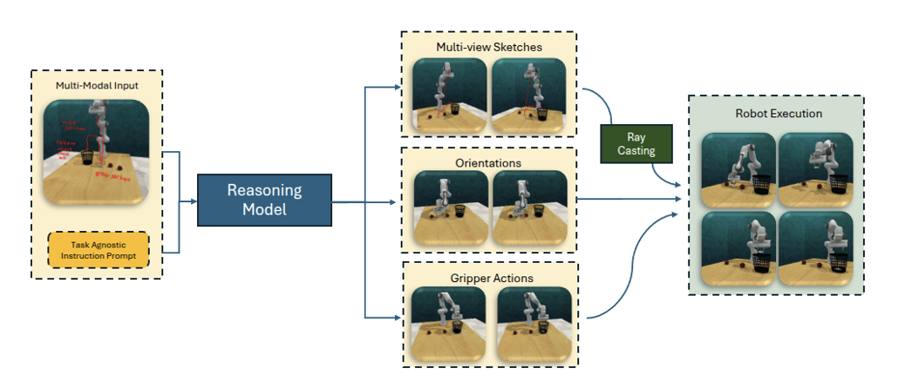

<link rel="stylesheet" href="assets/css/site.css">

<nav class="topbar">
  <a class="brand" href="index.html">Cross‑Mod</a>
  

    <a href="motivation.html">Motivation</a>
    <a href="method.html">Method</a>
    <a href="video-rollouts.html">Video Rollouts</a>
    <a href="ablations.html">Ablations</a>
    <a href="results-analysis.html">Results / Analysis</a>
    <a href="rl-refinement-future.html">RL Refinement / Future Work</a>
    <a href="https://arxiv.org/abs/2509.21107" target="_blank" rel="noopener">Paper</a>
    <a href="https://github.com/billbaron600/cross-mod/tree/main" target="_blank" rel="noopener">Code</a>
  

</nav>

<h1>Ablations &amp; Comparisons</h1>

This page isolates the contribution of <strong>hierarchical precision coupling</strong>—the mechanism that anchors high-level
reasoning to <em>pixel-accurate</em> spatial grounding—by removing it and measuring what breaks.

<h3>Main ablation: removing hierarchical precision coupling</h3>

<strong>(1) CrossInstruct (full system)</strong> separates “what to do” from “where exactly.” A large reasoning VLM interprets the
sketch/text intent, then a dedicated pointing model (Molmo) returns precise 2D keypoints. Those keypoints are fed back to
the reasoning model to anchor multi-view trajectory sketches before lifting them into 3D.

  

<strong>(2) VLM‑Reasoning (no precision coupling):</strong> remove Molmo; the reasoning model must both reason <em>and</em> draw the
trajectories / output end-effector poses directly over images. Everything else is kept the same (same demonstrations,
same evaluation seeds, same downstream pipeline).

  

<strong>Why this is a clean ablation:</strong> the only change is whether trajectory sketches are anchored by pixel-level keypoints.
This isolates the effect of precision coupling from the rest of the pipeline.

<h3>Baselines for context (not ablations)</h3>

We include <strong>TD3</strong> and <strong>SAC</strong> to answer a simple question:
<strong>how far can standard, exploration-driven reinforcement learning get on these RLBench tasks without any cross-modal supervision?</strong>
These baselines are not meant to compete on the same supervision signal. They are a reference point for what “from-scratch RL” achieves under the same task and compute budget.

<ul class="text">
  <li>
    <strong>Why TD3:</strong> a widely used off-policy actor critic for continuous control.
    It uses a <em>deterministic</em> policy and stabilizes learning with techniques like clipped double Q-learning and delayed policy updates.
    This is a strong baseline for sample-efficient, exploitation-focused learning.
  </li>
  <li>
    <strong>Why SAC:</strong> another widely used off-policy actor critic, but with a <em>stochastic</em> policy and entropy regularization.
    This makes it a strong baseline for exploration and robustness, which matters when rewards are sparse.
  </li>
  <li>
    <strong>Why both:</strong> together they bracket two common RL regimes:
    deterministic policies (TD3) versus entropy-regularized stochastic policies (SAC).
  </li>
</ul>

<strong>Training setup (kept intentionally standard):</strong>

<ul class="text">
  <li><strong>Reward:</strong> sparse binary success signal.</li>
  <li><strong>Budget:</strong> 1M environment steps per task.</li>
  <li><strong>No priors:</strong> standard implementations, without behavior cloning or cross-modal initialization.</li>
</ul>

<h3>Evaluation protocol</h3>

We evaluate <strong>generalization</strong> across randomized task instances in RLBench. All reported numbers are
<strong>success rate</strong> over <strong>20 held-out evaluation seeds</strong> per task.

<strong>Instruction-driven methods (CrossInstruct and the ablated variant)</strong>

<ul class="text">
  <li><strong>No task fine-tuning:</strong> there is no training or gradient update on the target task.</li>
  <li>
    <strong>Single demonstration seed:</strong> each task provides <strong>one</strong> sketched demonstration from a
    single seed. The demonstration exists only as a <strong>sketch over images</strong> (plus the instruction).
  </li>
  <li>
    <strong>Held-out testing:</strong> the method is then evaluated on <strong>20 unseen seeds</strong> for that task.
    This tests whether the system can transfer a single sketched intent to new object poses and scene variations.
  </li>
</ul>

<strong>Pure RL baselines (TD3 and SAC)</strong>

<ul class="text">
  <li><strong>Task training:</strong> the policy is trained on the task using environment interaction (sparse reward).</li>
  <li><strong>Evaluation split:</strong> after training, performance is measured on <strong>20 held-out seeds</strong>.</li>
</ul>

<strong>Metric</strong>

<ul class="text">
  <li>
    <strong>Success rate:</strong> the percentage of successful rollouts among the <strong>20 held-out evaluation seeds</strong>
    (one rollout per seed).
  </li>
</ul>

We also include qualitative real-world tests under domain and embodiment shift (different arm morphology and real sensor noise)
to assess whether the behaviors remain plausible beyond simulation.

