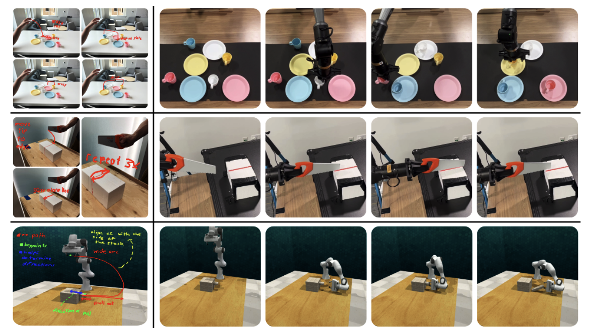

<link rel="stylesheet" href="assets/css/site.css">

# Cross-Mod: Cross-Modal Instructions for Robot Motion Generation

[**Code**](../) · [**Paper**](paper.md) · [**Method**](method.md) · [**Results**](results.md)

## 1-Minute Demos

**Basketball in Hoop**  
<video src="assets/video/basketball-in-hoop.mp4" controls playsinline width="640"></video>

**Close Drawer**  
<video src="assets/video/close-drawer.mp4" controls playsinline width="640"></video>

**Insert in Peg**  
<video src="assets/video/insert-in-peg.mp4" controls playsinline width="640"></video>

**Lift Numbered Block**  
<video src="assets/video/lift-numbered-block.mp4" controls playsinline width="640"></video>

**Play Jenga**  
<video src="assets/video/play-jenga.mp4" controls playsinline width="640"></video>

**Put Rubbish in Bin**  
<video src="assets/video/rubish-in-bin.mp4" controls playsinline width="640"></video>

**Slide Block to Target**  
<video src="assets/video/slide-block-to-target.mp4" controls playsinline width="640"></video>

**Sort Cups**  
<video src="assets/video/sort-cups-video-use.mp4" controls playsinline width="640"></video>

## Sketching + Pointing

