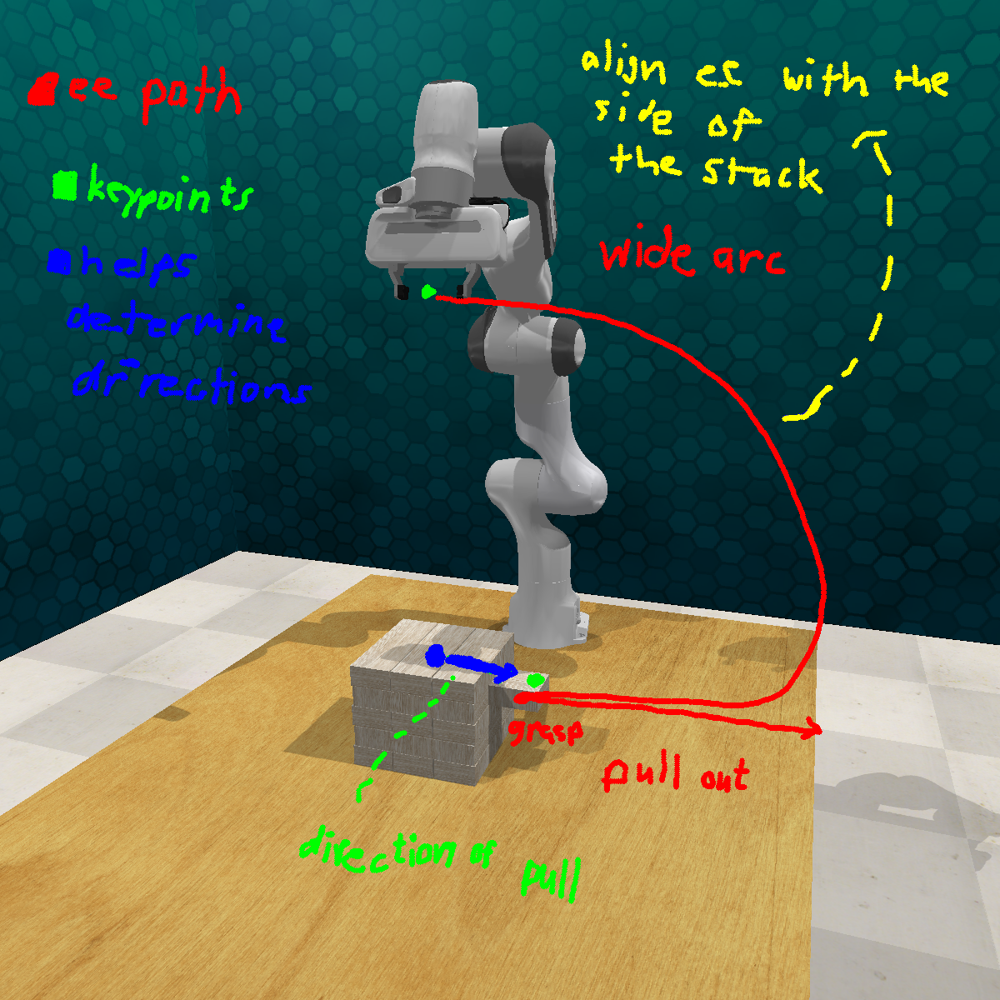
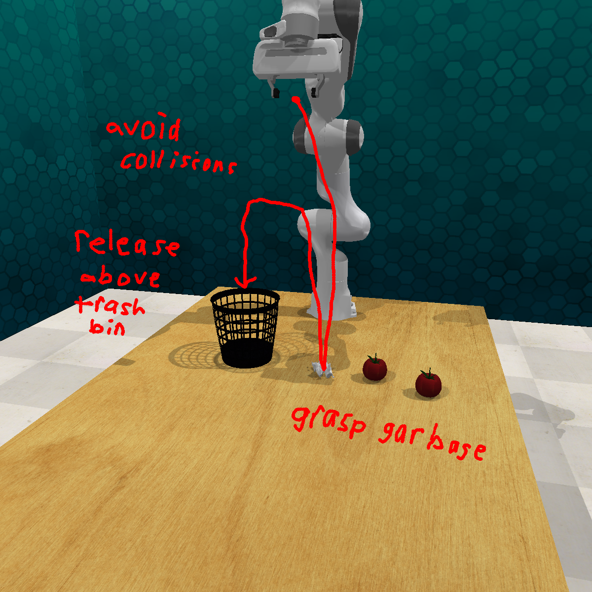
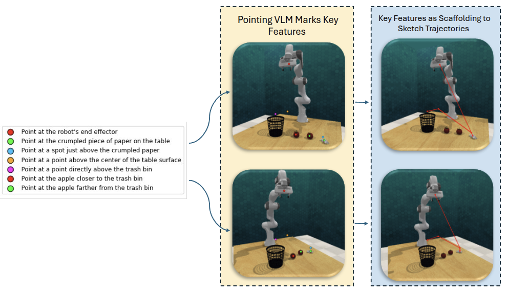
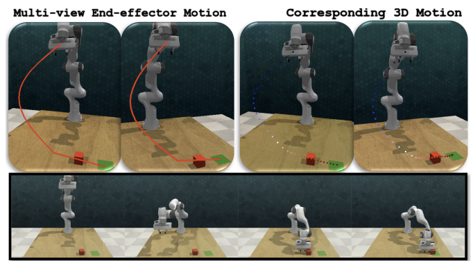
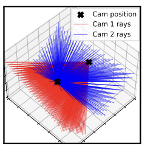

<link rel="stylesheet" href="assets/css/site.css">

<nav class="topbar">
  <a class="brand" href="index.html">Cross‑Mod</a>
  

    <a href="motivation.html">Motivation</a>
    <a href="method.html">Method</a>
    <a href="video-rollouts.html">Video Rollouts</a>
    <a href="ablations.html">Ablations</a>
    <a href="results-analysis.html">Results / Analysis</a>
    <a href="rl-refinement-future.html">RL Refinement / Future Work</a>
    <a href="https://arxiv.org/abs/2509.21107" target="_blank" rel="noopener">Paper</a>
    <a href="https://github.com/billbaron600/cross-mod/tree/main" target="_blank" rel="noopener">Code</a>
  

</nav>

# Method

Cross‑Mod turns rough <strong>sketch + text</strong> instructions into an executable robot motion. A human annotates two calibrated RGB camera views with freehand strokes (paths, arrows, “avoid” regions) and short notes (e.g., “grasp here”, “close gripper”, “repeat 3x”). We treat these annotations as lightweight “demonstrations”: at runtime, the system transfers the intent to a new scene, produces a 3D waypoint distribution plus orientation/gripper commands, and rolls out the mean trajectory open loop.

  

## Overview of the Loop

  <ol>
    <li><strong>Inputs:</strong> (1) one or more cross‑modal instruction examples and (2) a fresh two‑view observation of the current scene.</li>
    <li><strong>Reasoning:</strong> a large vision‑language model infers the task and breaks it into subgoals (reach, align, interact, retreat, repeat).</li>
    <li><strong>Semantic keypoints:</strong> it proposes the task‑critical points it must hit (e.g., “button center”, “block edge”, “bin rim”).</li>
    <li><strong>Precision coupling:</strong> a lightweight pointing model converts each keypoint description into pixel‑accurate coordinates in both views.</li>
    <li><strong>2D trajectory sketching:</strong> with grounded pixels in context, the reasoning model draws a smooth 2D end‑effector path in each view that connects the keypoints and respects any “avoid/collision” hints.</li>
    <li><strong>Lift to 3D:</strong> calibrated ray casting fuses the two per‑view paths into a time‑aligned 3D waypoint distribution.</li>
    <li><strong>Execution:</strong> the system outputs (a) a 3D waypoint sequence, (b) end‑effector orientations, and (c) gripper open/close events. The robot tracks the mean path open loop; sampled paths provide diverse rollouts for learning.</li>
  </ol>

## Diagrammatic Sketches Over Camera Images

Cross‑modal instructions are intentionally lightweight: they capture <strong>shape</strong> (“go around this object”), <strong>contacts</strong> (“grasp here”), and <strong>constraints</strong> (“don’t hit this wall”) without requiring teleoperation. Because the sketches live directly in image space, they’re quick to provide and naturally aligned with what the robot sees.

  
  

## Reasoning Model: Task, Subgoals, and Keypoints

A large reasoning VLM reads the instruction(s) and the current two‑view observation to decide <strong>what the task is</strong> and <strong>what must be precise</strong>. It produces:

  <ul>
    <li><strong>Task identification:</strong> what manipulation is being requested (press, pick‑and‑place, insertion, sliding, tool use).</li>
    <li><strong>Subgoal structure:</strong> reach → align → interact → retreat (and any repeats).</li>
    <li><strong>Semantic keypoint descriptors:</strong> short phrases for the exact points needed to execute (targets, contact points, alignment edges).</li>
    <li><strong>Initial motion intent:</strong> a rough per‑view plan consistent with the sketch and text.</li>
  </ul>

These keypoints start as language (e.g., “rim edge”, “button center”). The next step is grounding them to pixel coordinates so the motion is actually executable.

## Precision Coupling: Pixel‑Accurate Keypoints

We couple the reasoning VLM to a small pointing model that specializes in <strong>turning a keypoint description into a precise pixel coordinate</strong> in each view. Those pixel locations are injected back into the reasoning model’s context, so the final plan is both semantically correct and geometrically precise (critical for small targets like buttons, peg holes, and block edges).

  

## Full Loop: From Grounded Pixels to 3D Motion

Once keypoints are grounded to pixels in both cameras, Cross‑Mod turns those pixels into an executable 6‑DoF plan in three stages:
(1) sketch a continuous 2D path in each view, (2) lift the two paths into a time‑indexed 3D waypoint distribution via calibrated ray casting,
and (3) execute the mean trajectory open loop with orientations and gripper events.

<figure class="section method-media method-media--wide">
  
  <figcaption class="text">
    Left: per‑view 2D end‑effector paths. Right: corresponding lifted 3D waypoints. Bottom: the resulting open‑loop rollout.
  </figcaption>
</figure>

<h3>1) Continuous 2D paths (per view)</h3>

With pixel-accurate keypoints in context, the reasoning model redraws a clean, smooth end‑effector path in each camera view.
The two paths are produced with the same number of samples, so “time step t” refers to the same progress along the motion in both views.
This time alignment is what makes point‑by‑point multi‑view fusion possible.

We treat each path as a corridor rather than a single pixel-wide polyline. Concretely: at each time step, the drawn pixel is the center of a small
uncertainty region in image space. This makes the lift robust to small sketch variation, minor ambiguities, and the fact that real scenes rarely
match an instruction example perfectly.

<h3>2) Ray casting lift: from two 2D corridors to a 3D waypoint distribution</h3>

To lift into 3D we use the known calibration of the two cameras (intrinsics + extrinsics). For a given time step, we sample pixels from the corridor
in view 1 and view 2, cast the corresponding rays into 3D, and keep 3D points that are simultaneously consistent with both views.
In practice, rays will not intersect perfectly, so we keep near-consistent pairs (within a small reprojection tolerance) and aggregate the resulting 3D samples.

This produces a set of feasible 3D points per time step. We summarize that set as a compact 3D waypoint distribution over time:
the mean is the “centerline” trajectory we execute, and the spread captures where the sketch admits multiple valid realizations.

<figure class="section method-media">
  
  <figcaption class="text">
    Multi‑view lifting intuition: rays from both cameras constrain each waypoint in 3D.
  </figcaption>
</figure>

(Optional but useful for explanation/visualization.) After lifting, you can project the 3D mean waypoints back into both camera views to sanity-check that
the lifted motion still follows the intended 2D geometry. This is also a good “debug view” for calibration and corridor width.

<h3>3) Open‑loop rollout with orientations + gripper actions</h3>

The final output is not just positions. Along the mean 3D waypoint sequence, the reasoning model specifies end‑effector orientations
(to align with edges, slots, pull directions, or approach normals) and discrete gripper open/close events at the appropriate times.
We then track the mean plan open loop using a lightweight controller (e.g., IK-based tracking or reactive primitives), preserving the
sketch-implied shaping and clearances.

<h3>Using the distribution (optional): diverse rollouts for RL warm‑start</h3>

Because the lift yields a distribution, we can sample multiple intent‑consistent trajectories (not just one). These samples can be executed in simulation
to cheaply generate varied rollouts that remain faithful to the instruction, and then used as low-cost demonstrations to warm-start downstream RL
(or as persistent behavior-cloning regularization during RL refinement).

