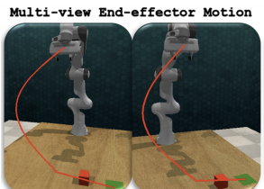
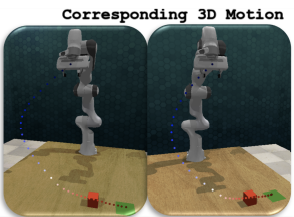
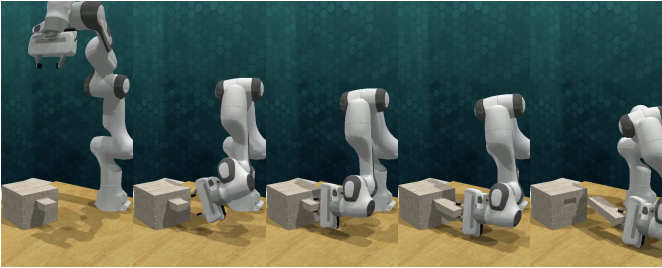

<link rel="stylesheet" href="assets/css/site.css">

<nav class="topbar">
  <a class="brand" href="index.html">Cross‑Mod</a>
  

    <a href="motivation.html">Motivation</a>
    <a href="method.html">Method</a>
    <a href="video-rollouts.html">Video Rollouts</a>
    <a href="ablations.html">Ablations</a>
    <a href="results-analysis.html">Results / Analysis</a>
    <a href="rl-refinement-future.html">RL Refinement / Future Work</a>
    <a href="https://arxiv.org/abs/2509.21107" target="_blank" rel="noopener">Paper</a>
    <a href="https://github.com/billbaron600/cross-mod/tree/main" target="_blank" rel="noopener">Code</a>
  

</nav>

# Method

Cross‑Mod implements the <strong>CrossInstruct</strong> framework: it turns <strong>cross‑modal instructions</strong>—rough sketches and short text labels drawn over an image—into an executable robot motion in a <em>new</em> scene.
At runtime the robot receives a fresh <strong>two‑view RGB observation</strong> (two calibrated cameras). The system synthesizes a <strong>distribution over 3D end‑effector trajectories</strong> (waypoints over time) together with <strong>orientations</strong> and <strong>gripper open/close</strong> events, then executes the <strong>mean</strong> trajectory open loop.

  

## Pipeline at a Glance

  <ol>
    <li><strong>Inputs:</strong> (a) one or more cross‑modal instruction examples and (b) a new two‑view observation of the current scene.</li>
    <li><strong>Precision coupling:</strong> a reasoning VLM proposes task‑critical <em>semantic keypoints</em>, then a lightweight pointing model grounds them to pixel‑accurate coordinates in each view.</li>
    <li><strong>Multi‑view sketching:</strong> using those grounded pixels as scaffolding, the reasoning model draws an equal‑length 2D end‑effector path in each camera view.</li>
    <li><strong>Lift to 3D:</strong> calibrated ray casting fuses the two 2D paths into a time‑indexed 3D waypoint <em>distribution</em>.</li>
    <li><strong>Outputs:</strong> a mean 3D waypoint sequence + end‑effector orientations + gripper events (with the distribution available for diverse rollouts).</li>
  </ol>

## Cross‑Modal Instruction Examples

Cross‑modal instructions are intentionally lightweight: they capture <strong>shape</strong> (“go around this object”), <strong>contacts</strong> (“grasp here”),
and <strong>constraints</strong> (“avoid this region”) without requiring teleoperation. Because the annotations live directly in image space, they’re fast to provide
and naturally aligned with what the robot sees.

  
  

## Hierarchical Precision Coupling

CrossInstruct splits the problem into two coupled roles:
(1) a <strong>reasoning model</strong> that interprets intent (task identification, decomposition, constraints), and
(2) a <strong>pointing model</strong> that specializes in <em>pixel‑accurate</em> localization of task‑critical points.
The reasoning model first proposes semantic keypoints (language like “button center” or “bin rim”), then the pointing model grounds each description
to a precise pixel coordinate in both views. Those grounded pixels are injected back into the reasoning context so the final motion is both
semantically correct <em>and</em> geometrically precise.

  

## Multi‑View Motion Synthesis

### 1) Equal‑length 2D paths (one per view)

With pixel‑accurate keypoints in context, the reasoning model redraws a clean, smooth end‑effector path in each camera view.
The two paths are produced with the <strong>same number of samples</strong>, so time step <em>t</em> refers to the same progress along the motion in both views.

Rather than treating the sketch as a single pixel‑wide polyline, we treat it as a <strong>corridor</strong>: each time step corresponds to a small uncertainty
region around the drawn pixel. This makes the multi‑view lift robust to minor sketch variation and small mismatches between an instruction example
and the current scene.

<figure class="section method-media method-media--wide">
  
  <figcaption class="text">
    Continuous 2D paths in both views, time‑aligned for point‑by‑point fusion.
  </figcaption>
</figure>

### 2) Multi‑view lifting via calibrated ray casting (2D → 3D distribution)

To lift into 3D we use the known calibration of the two cameras (intrinsics + extrinsics). For a given time step, we sample pixels from the corridor in
view 1 and view 2, cast the corresponding rays into 3D, and keep 3D points that are simultaneously consistent with both views (within a small tolerance).
Aggregating these samples yields a <strong>set of feasible 3D points per time step</strong>.

<figure class="section method-media">
  
  <figcaption class="text">
    Multi‑view lifting intuition: rays from both cameras constrain each waypoint in 3D.
  </figcaption>
</figure>

We summarize the feasible 3D samples at each time step as a compact <strong>3D waypoint distribution</strong> over time:
the mean is the “centerline” trajectory we execute, and the spread captures where the sketch admits multiple valid realizations.

<figure class="section method-media method-media--wide">
  
  <figcaption class="text">
    Lifted 3D trajectory reprojected back onto the camera images for a consistency check.
  </figcaption>
</figure>

### 3) Execution outputs: waypoints + orientations + gripper events

The final output is not just positions. Along the mean 3D waypoint sequence, the reasoning model also specifies
<strong>end‑effector orientations</strong> (to align with edges, slots, pull directions, or approach normals) and discrete
<strong>gripper open/close</strong> events at the appropriate times.
The robot then tracks the mean plan open loop using a lightweight controller (e.g., IK-based tracking or reactive primitives),
preserving sketch‑implied shaping and clearances.

<figure class="section method-media method-media--wide">
  
  <figcaption class="text">
    Top: per‑view 2D paths. Middle: lifted 3D waypoints. Bottom: the resulting open‑loop rollout.
  </figcaption>
</figure>

<figure class="section method-media method-media--wide">
  
</figure>

Because Cross‑Mod produces a <em>distribution</em> (not a single trajectory), it can also sample diverse rollouts that are consistent with the same instruction.
Those sampled rollouts are useful for downstream learning and refinement (see <a href="rl-refinement-future.html">RL Refinement / Future Work</a>).

