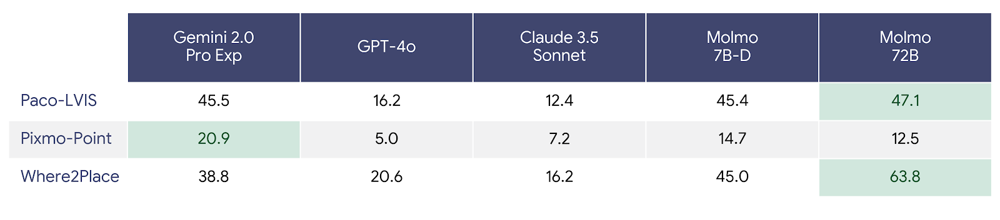
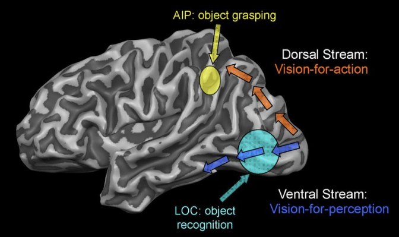

<link rel="stylesheet" href="assets/css/site.css">

<nav class="topbar">
  <a class="brand" href="index.html">Cross-Mod</a>
  

    <strong>Motivation</strong>
    <a href="method.html">Method</a>
    <a href="video-rollouts.html">Video Rollouts</a>
    <a href="ablations.html">Ablations</a>
    <a href="results-analysis.html">Results / Analysis</a>
    <a href="rl-refinement-future.html">RL Refinement / Future Work</a>
    <a href="https://arxiv.org/abs/2509.21107" target="_blank" rel="noopener">Paper</a>
    <a href="https://github.com/billbaron600/cross-mod/tree/main" target="_blank" rel="noopener">Code</a>
  

</nav>

# Motivation

## From semantic reasoning to spatial control

Recent multimodal foundation models such as Gemini 2.0 and <a href="https://arxiv.org/abs/2503.20020" target="_blank" rel="noopener">Gemini Robotics</a> can interpret camera images and natural language instructions and then synthesize structured plans together with low level action sequences that call a robot control API. The Gemini Robotics report demonstrates systems that identify task relevant objects, decompose instructions into subgoals, and generate parameterized trajectories for manipulation tasks such as folding towels, packing snacks, and bimanual handovers.

These capabilities suggest that high level semantic reasoning is becoming less of a bottleneck for many manipulation problems. Given a goal like “put the mug on the plate,” large vision language models typically recognize the relevant entities, propose a sensible order of operations, and respect basic physical constraints. However, they are not trained primarily as controllers. A model may reason correctly about what the robot should do while still placing a grasp point or button press several pixels away from the true contact region, which is enough to miss small objects or collide with clutter.

It is therefore useful to distinguish between <strong>semantic task understanding</strong> and <strong>fine grained spatial localization</strong>:

<ul class="text" style="margin-left: 2rem;">
  <li>
    <strong>Semantic task understanding.</strong>
    Mapping language and images to goals, constraints, subgoals, and high level plans that are causally sensible.
  </li>
  <li>
    <strong>Fine grained spatial localization.</strong>
    Identifying contact locations, trajectories, and free space with pixel level or millimeter level precision so that grasps and actions are reliable in clutter.
  </li>
</ul>

## Quantifying the spatial precision gap

The <a href="https://arxiv.org/abs/2503.20020" target="_blank" rel="noopener">Gemini Robotics</a> report directly measures 2D pointing accuracy on three benchmarks that matter for manipulation: Paco LVIS, PixMo Point, and <a href="https://huggingface.co/datasets/wentao-yuan/where2place" target="_blank" rel="noopener">Where2Place</a>. These datasets require a model to output pixel coordinates that fall inside ground truth masks for parts, affordances, or feasible placement regions.

On Where2Place, the reported accuracies are approximately:

<ul class="text" style="margin-left: 2rem;">
  <li>Gemini 2.0 Pro Experimental: 38.8</li>
  <li>Gemini Robotics ER: 45.0</li>
  <li>GPT 4o: 20.6</li>
  <li>Claude 3.5 Sonnet: 16.2</li>
  <li>Molmo 7B D: 45.0</li>
  <li>Molmo 72B: 63.8</li>
</ul>

Even under a shared evaluation protocol, state of the art chat oriented VLMs remain far behind both a robotics fine tuned Gemini variant and the open weight Molmo models on this dense pointing task.

The <a href="https://arxiv.org/abs/2409.17146" target="_blank" rel="noopener">Molmo and PixMo</a> work provides an important contrast:

<ul class="text" style="margin-left: 2rem;">
  <li>
    <strong>Molmo 7B D</strong> uses a 7 billion parameter backbone but already matches or exceeds much larger proprietary VLMs on several pointing benchmarks.
  </li>
  <li>
    <strong>Molmo 72B</strong> achieves the strongest reported Where2Place score among the models considered.
  </li>
  <li>
    Both models are trained with the PixMo suite, which includes a large 2D pointing dataset collected specifically for precise localization.
  </li>
</ul>

In other words, a comparatively small VLM that is explicitly trained for pointing can outperform much larger generalist models on spatial precision, and can remain competitive even with a robotics specialized model like Gemini Robotics ER.

These results indicate that high level multimodal reasoning and fine grained spatial localization behave as at least partially independent capability axes:

<ul class="text" style="margin-left: 2rem;">
  <li>Scaling a generalist model improves pointing performance to some extent.</li>
  <li>Targeted pointing data and objectives provide much larger gains on dense localization tasks.</li>
</ul>

We refer to the resulting performance difference between semantic reasoning and precise localization as the <strong>spatial precision gap</strong>. Later sections of this page and the paper will examine how modular architectures can narrow this gap without continually retraining a single monolithic model.

  

## Path A: monolithic embodied VLMs

One response to the spatial precision gap is to fine tune a large general purpose VLM on robotics and pointing data so that a single model produces both task plans and precise action parameters. Gemini Robotics ER follows this strategy. It extends Gemini 2.0 with images, language, and robot data so that one model predicts object detections, 3D bounding boxes, grasps, 2D keypoints, and robot actions from multimodal input.

This monolithic approach is powerful but introduces several concerns:

<ol class="text" style="margin-left: 2rem;">
  <li>
    <strong>Catastrophic forgetting.</strong>
    Full parameter fine tuning on a narrow downstream task can degrade earlier capabilities if the original training data are not revisited. Fine tuning for embodied pointing and control changes the internal representations that also support code generation, mathematical reasoning, and other skills. Modern techniques can reduce forgetting, but they increase system complexity and are not always accessible for proprietary backbones.
  </li>
  <li>
    <strong>Tightly coupled heterogeneous skills.</strong>
    Semantic reasoning, 3D world modeling, and closed loop control operate on different time scales, sensor modalities, and error tolerances. Folding all of them into a single parameter space makes it difficult to improve or debug one capability without affecting others. Updating the model to improve pointing on a new robot might alter its language behavior, its safety filters, or its performance on unrelated perception tasks.
  </li>
  <li>
    <strong>Limited reusability and interpretability.</strong>
    When a single network encodes both high level plans and low level spatial details, it is difficult to expose stable interfaces that other systems can rely on. This complicates safety analysis, tool integration, and scientific reuse, since researchers cannot easily swap out or independently train components for perception, planning, and control.
  </li>
  <li>
    <strong>High iteration cost.</strong>
    Large monolithic specialists are expensive to iterate. Each new robotics capability or embodiment that requires fine tuning must be added through another full training phase on a large proprietary stack. This is feasible for a small number of industrial labs, but it is a high barrier for most academic or open source efforts.
  </li>
</ol>

These issues echo broader critiques of end to end learning for embodied agents. In position papers such as <a href="https://openreview.net/pdf?id=BZ5a1r-kVsf" target="_blank" rel="noopener">A Path Towards Autonomous Machine Intelligence</a>, LeCun and others argue for architectures that separate modules like perception, world models, actors, and critics, each operating at its natural time scale and level of abstraction. In that view, trying to make a single VLM behave as both the world model and the controller conflates roles that are better handled by interacting but distinct components.

## Path B: modular reasoner-pointer architectures

An alternative design treats semantic reasoning and precise localization as separate but tightly coupled modules. In this class of architectures, a large generalist reasoning VLM and a smaller pointing specialized VLM are composed through an explicit interface.

<ul class="text" style="margin-left: 2rem;">
  <li>
    The <strong>reasoning VLM</strong> takes images and language as input, interprets the task, identifies relevant objects and constraints, and emits structured descriptors such as semantic keypoints, subgoal descriptions, or coarse trajectory sketches. Its parameters remain frozen across robotics applications so that general capabilities are preserved.
  </li>
  <li>
    The <strong>pointing VLM</strong> is a compact model trained specifically for pixel level localization. Given a descriptor and one or more images, it predicts 2D coordinates for task critical locations. Models like Molmo fine tuned on PixMo style pointing data illustrate that this role can be filled by a comparatively small open weight VLM while still achieving state of the art pointing performance.
  </li>
</ul>

A coupling module maintains shared context between the two components:

<ol class="text" style="margin-left: 2rem;">
  <li>Descriptors from the reasoning model are passed to the pointing model.</li>
  <li>The pointing model returns concrete image coordinates for keypoints or contact regions.</li>
  <li>These coordinates are fed back into the reasoning model or a downstream planner to update sketches, synthesize 3D waypoints, and generate control commands.</li>
</ol>

Conceptually, this resembles a classical navigation stack where a global planner reasons over maps and goals, and a local controller uses sensor feedback to track trajectories and avoid obstacles. Here, the reasoning VLM plays the role of the global planner, while the pointing VLM behaves like a specialized estimator that turns symbolic references into metric contact points.

This modular pattern offers several advantages:

<ul class="text" style="margin-left: 2rem;">
  <li>It preserves the general reasoning abilities of the large VLM, which can be reused across embodiments and tasks.</li>
  <li>It isolates the high variance spatial estimation problem into a smaller component that can be retrained or replaced without disturbing the rest of the system.</li>
  <li>It exposes interpretable intermediate representations, such as named keypoints and trajectories, that can be logged, inspected, or constrained by classical control stacks and safety monitors.</li>
</ul>

In the remainder of the work, we adopt this modular reasoner pointer template and instantiate it with a large frozen reasoning VLM and a pointing specialized VLM that operates over multi view images. The hierarchical precision coupling between these components will be evaluated later through ablations that compare pure reasoning, pure pointing, and coupled variants.

## Biological and systems motivation for separation

The separation between reasoning and pointing modules is also supported by evidence from visual neuroscience. When visual input reaches occipital cortex, it diverges into at least two major pathways:

  

<ul class="text" style="margin-left: 2rem;">
  <li>
    A <strong>ventral stream</strong>, projecting toward inferior temporal cortex, that supports object recognition and semantic identification.
  </li>
  <li>
    A <strong>dorsal stream</strong>, projecting toward posterior parietal areas, that supports spatial localization and visually guided action.
  </li>
</ul>

Classic work by Goodale and Milner and subsequent reviews emphasize this division between perception for recognition and perception for action, with areas such as lateral occipital complex (LOC) and anterior intraparietal area (AIP) playing key roles.

These streams are not independent. There is substantial interaction and information flow between them, and later work has refined the simple “what versus where” story. Yet the basic organizational principle remains useful: biological systems separate the processing that builds a semantic model of the scene from the processing that supports real time control of the hand in that scene.

Modular reasoner pointer architectures take a similar approach:

<ul class="text" style="margin-left: 2rem;">
  <li>The reasoning VLM plays a ventral like role, maintaining an object and task centered description of the scene.</li>
  <li>The pointing VLM plays a dorsal like role, using that description to pick metrically accurate contact points in the image.</li>
  <li>The coupling between them is analogous to the recurrent interaction between temporal and parietal cortex.</li>
</ul>

From both engineering and biological perspectives, separating these roles provides a principled way to narrow the spatial precision gap without repeatedly retraining a single monolithic model on increasingly specialized data.

