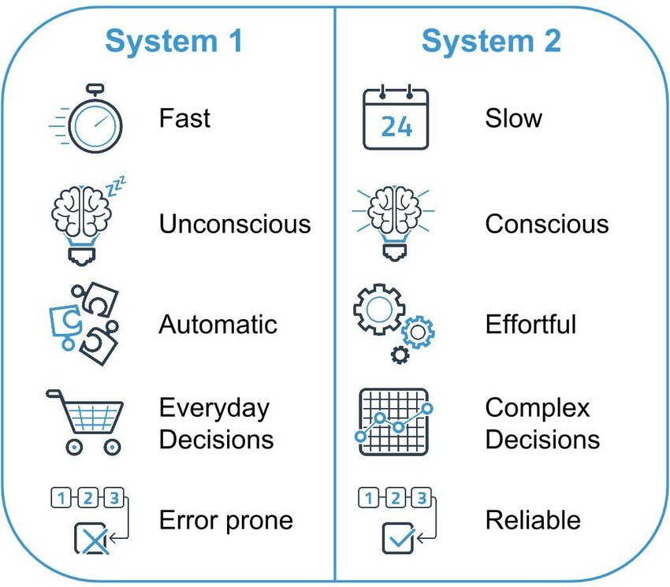
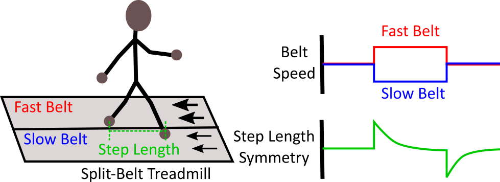

<link rel="stylesheet" href="assets/css/site.css">

<nav class="topbar">
  <a class="brand" href="index.html">Cross‑Mod</a>
  

    <a href="motivation.html">Motivation</a>
    <a href="method.html">Method</a>
    <a href="video-rollouts.html">Video Rollouts</a>
    <a href="ablations.html">Ablations</a>
    <a href="results-analysis.html">Results / Analysis</a>
    <a href="rl-refinement-future.html">RL Refinement / Future Work</a>
    <a href="https://arxiv.org/abs/2509.21107" target="_blank" rel="noopener">Paper</a>
    <a href="https://github.com/billbaron600/cross-mod/tree/main" target="_blank" rel="noopener">Code</a>
  

</nav>

# Motivation

**Origins and scope.** The dual-process framework comes from cognitive psychology’s study of judgment and decision making, notably the heuristics-and-biases program by Amos Tversky and Daniel Kahneman, which documented systematic departures from normative rationality in perception, inference, and choice ([Tversky & Kahneman, 1974](https://doi.org/10.1126/science.185.4157.1124)). Building on this work, dual-process accounts formalize a distinction between fast, automatic processes and slower, controlled processes as an explanation for those deviations and for context-dependent variability in performance; see Kahneman’s synthesis on bounded rationality and dual processing ([Kahneman, 2003](https://doi.org/10.1037/0003-066X.58.9.697)). In contemporary machine learning, this lens is often used to interpret reasoning models as analogs of the slower, deliberative system, particularly when they use explicit planning, tool use, and multi-step reflection.

## Dual-process cognition: formal view
**System 2 (S2)** denotes controlled, slower, sequential, and rule-based processing: effortful, working-memory-limited, but capable of explicit reasoning, analytic decomposition, and reduced error under novel mappings. A classic treatment is Kahneman’s overview of bounded rationality and dual processing ([American Psychologist, 2003](https://doi.org/10.1037/0003-066X.58.9.697)).  
In contemporary ML, large **reasoning** models are often framed as S2-like, with explicit planning and tool use; see, e.g., ([podcast link](https://sequoiacap.com/podcast/training-data-noam-brown/)).

**System 1 (S1)** denotes automatic, rapid, parallel, and associative processing: effortless, cue-driven, high-throughput, but susceptible to biases and context-dependent errors.  

**System 2 (S2)** denotes controlled, slower, sequential, and rule-based processing: effortful, working-memory-limited, but capable of explicit reasoning, analytic decomposition, and reduced error under novel mappings. A classic treatment is Kahneman’s overview of bounded rationality and dual processing ([American Psychologist, 2003](https://doi.org/10.1037/0003-066X.58.9.697)).  

In contemporary ML, large **reasoning** models are often framed as S2-like, with explicit planning and tool-use; see, e.g., ([podcast link](https://sequoiacap.com/podcast/training-data-noam-brown/)).

<figure class="section">
  
</figure>

## How this maps to robot instruction-following

Reasoning models (S2-like) excel at:

1) interpreting **sketched demonstrations**: curves, arrows, text, and constraints drawn over calibrated views that implicitly encode end-effector path shape and contact intent;  
2) **task decomposition**: identifying sub-goals, ordering, and geometric preconditions.

However, converting those abstractions into motion requires **pixel-level grounding** at high precision (button centerlines, rim edges, peg axes). Rather than routing all decisions through a monolithic action policy, we treat a **smaller VLM** as an **auxiliary precision tool** that the reasoner can call to resolve keypoints exactly in each view.

### Our premise: a direct S2 → actuation representation

We “let S2 speak in the language of motion.” Concretely, the reasoning model:
- infers the task and decomposes it into steps,
- proposes semantic **precision descriptors** for high-value points,
- calls a **small pointing VLM** to localize those descriptors as **pixel-accurate keypoints** in each calibrated view,
- **sketches per-view end-effector paths** that connect these keypoints,
- **lifts** the paired 2D sketches into a **time-indexed 3D trajectory distribution**, and
- outputs the **full end-effector command sequence**: position, orientation, and gripper action.

This pipeline makes the reasoning model part of the *actuation representation* itself, not just the high-level planner. Having the reasoning model **draw the path between precision points** bakes in *implicit collision shaping* and *trajectory smoothness* without relying on semantic segmentation, inverse-geometry grasp solvers, MPC-style controllers, or other traditional stacks.

### Why multi-view RGB suits this formulation

Most multimodal reasoning models are trained predominantly on **RGB imagery**, so sketched RGB inputs stay close to their pretraining distribution. Our method uses **two calibrated RGB views**; multi-view lifting reduces depth ambiguity and stabilizes 3D waypoint estimation compared with a single view (even if that single view has noisy/scarce depth), while keeping inputs in the RGB regime where reasoning models are strongest. 

## Why suppress System 1 early?

Early in skill acquisition, S1-style controllers can systematically mis-map perception to action under **inverted** or **non-intuitive** sensorimotor transforms. An S2 policy that follows explicit rules avoids these traps; only after repetition does a robust S1-like controller re-emerge. This mirrors our design choice to have the reasoning model specify **explicit trajectories** at first, rather than delegating immediately to a VLA.

**Formalized examples:**

<figure class="section narrow">
  
  <figcaption><strong>Laparoscopic “fulcrum effect”.</strong> Because the tool pivots at the trocar, handle motion is inverted with respect to tip motion in Cartesian space. Habitual S1 mappings (“move toward the target”) create sign-flipped corrections and oscillation. An S2 controller applies the rule “move handle opposite desired tip displacement,” yielding slower but correct behavior; with practice, a new S1 policy is cached.</figcaption>
</figure>

<figure class="section narrow">
  
  <figcaption><strong>Split-belt adaptation.</strong> With asymmetric belt speeds, the symmetric-gait prior (S1) fails. S2 enforces asymmetric step timing; later, automaticity returns with a retuned S1 controller.</figcaption>
</figure>

**Relevance to method choice.**  
Classical pipelines often rely on motion planners/collision-avoidance or hand-engineered grasp/waypoint generators; learned **VLA** pipelines place a monolithic action policy between S2-style reasoning and actuation. Both add a dependency that can entangle S2 intent with S1 behaviors. Our approach keeps S2 in the driver’s seat initially—explicit keypoints and **sketched paths** → **3D trajectories**—minimizing reliance on traditional stacks and avoiding the “S2 must always route through S1” failure mode seen when a reasoner can only act via a VLA. The result is a cleaner S2→actuation interface that later supports distillation if desired. (See §IV–V for the precision-coupled lifting and empirical results.) :contentReference[oaicite:2]{index=2}

