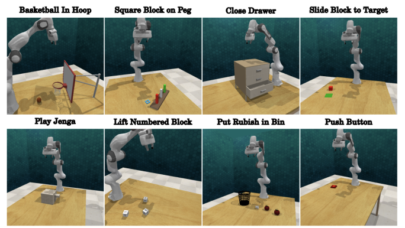
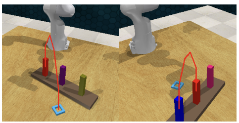

<link rel="stylesheet" href="assets/css/site.css">

<nav class="topbar">
  <a class="brand" href="index.html">Cross‑Mod</a>
  

    <a href="motivation.html">Motivation</a>
    <a href="method.html">Method</a>
    <a href="video-rollouts.html">Video Rollouts</a>
    <a href="ablations.html">Ablations</a>
    <a href="results-analysis.html">Results / Analysis</a>
    <a href="rl-refinement-future.html">RL Refinement / Future Work</a>
    <a href="https://arxiv.org/abs/2509.21107" target="_blank" rel="noopener">Paper</a>
    <a href="https://github.com/billbaron600/cross-mod/tree/main" target="_blank" rel="noopener">Code</a>
  

</nav>

<H1> Results </H1>

  

    
  

 

  <table class="metrics">
    <caption>Task Success Rates for the Different Methods</caption>
    <thead>
      <tr>
        <th>Task</th>
        <th>CrossInstruct</th>
        <th>VLM-Reasoning</th>
        <th>Pure RL (SAC)</th>
        <th>Pure RL (TD3)</th>
      </tr>
    </thead>
    <tbody>
      <tr>
        <td>basketball</td>
        <td style="background:#d1fae5;">0.90</td>
        <td>0.00</td>
        <td>0.00</td>
        <td>0.00</td>
      </tr>
      <tr>
        <td>peg</td>
        <td style="background:#d1fae5;">0.25</td>
        <td>0.20</td>
        <td>0.00</td>
        <td>0.00</td>
      </tr>
      <tr>
        <td>close drawer</td>
        <td>0.90</td>
        <td>0.45</td>
        <td style="background:#d1fae5;">0.95</td>
        <td>0.40</td>
      </tr>
      <tr>
        <td>slide block</td>
        <td style="background:#d1fae5;">0.90</td>
        <td>0.20</td>
        <td>0.10</td>
        <td>0.00</td>
      </tr>
      <tr>
        <td>jenga</td>
        <td style="background:#d1fae5;">0.55</td>
        <td>0.00</td>
        <td>0.00</td>
        <td>0.00</td>
      </tr>
      <tr>
        <td>lift block</td>
        <td style="background:#d1fae5;">0.95</td>
        <td>0.00</td>
        <td>0.00</td>
        <td>0.00</td>
      </tr>
      <tr>
        <td>rubbish</td>
        <td style="background:#d1fae5;">1.00</td>
        <td>0.00</td>
        <td>0.00</td>
        <td>0.00</td>
      </tr>
      <tr>
        <td>push button</td>
        <td style="background:#d1fae5;">0.95</td>
        <td>0.30</td>
        <td>0.05</td>
        <td>0.00</td>
      </tr>
      <tr>
        <td style="background:#111;color:#fff;font-weight:700;">Average</td>
        <td style="background:#d1fae5;font-weight:700;">0.80</td>
        <td style="background:#fee2e2;font-weight:700;">0.14</td>
        <td style="background:#fee2e2;font-weight:700;">0.14</td>
        <td style="background:#fee2e2;font-weight:700;">0.05</td>
      </tr>
    </tbody>
  </table>

<H1> Analysis </H1>

CrossInstruct outperforms the VLM-Reasoning ablation on <strong>all 8 RLBench tasks</strong>. The pattern in the table suggests that the main
difference is not “can the model plan the right behavior,” but whether it can <strong>reliably localize the correct object and contact point</strong>
when the scene is visually ambiguous.

<strong>CrossInstruct vs. VLM-Reasoning (no precision coupling)</strong>

<ul class="text">
  <li>
    <strong>Average success rate:</strong> CrossInstruct = 0.80, VLM-Reasoning = 0.14 (absolute +0.66).
  </li>
  <li>
    <strong>Consistent win:</strong> CrossInstruct is higher on every task, including <strong>Square Block on Peg</strong>, which is one of the most
    precision-sensitive tasks.
  </li>
</ul>

<strong>Why “bright, distinctive targets” reduce the gap</strong>

<ul class="text">
  <li>
    The smallest gaps tend to appear on tasks where the relevant objects are visually salient and high-contrast.
    In our task set, <strong>Square Block on Peg</strong>, <strong>Slide Block to Target</strong>, and <strong>Push Button</strong> feature bright,
    saturated objects or targets that are easy to pick out visually.
  </li>
  <li>
    On these tasks, even a reasoning-only model can sometimes ground “the right thing” from color and simple geometry cues, so it can look
    comparatively stronger than on tasks with less distinctive targets.
  </li>
  <li>
    In contrast, tasks like <strong>Basketball in Hoop</strong>, <strong>Close Drawer</strong>, <strong>Play Jenga</strong>, <strong>Lift Numbered Block</strong>,
    and <strong>Put Rubbish in Bin</strong> often involve more clutter, weaker color gradients, or less isolated targets. In these settings, small grounding
    errors become common and success drops sharply without precision coupling.
  </li>
</ul>

<strong>Concrete disambiguation failure in VLM-Reasoning (Square Block on Peg)</strong>

  

<ul class="text">
  <li>
    The qualitative example highlights the core limitation: the model can confuse <strong>which object instance is the target</strong> when multiple
    objects share similar colors.
  </li>
  <li>
    In the left case, the correct interaction is “move the <strong>blue square</strong> onto the <strong>red peg</strong>.” However, because there is also a
    <strong>blue peg</strong> present, the reasoning-only variant draws a trajectory from the <strong>blue peg</strong> to the <strong>red peg</strong>.
  </li>
  <li>
    This is not a planning error. It is a <strong>grounding and disambiguation</strong> error. The model latched onto the wrong blue object (a peg rather than
    the square), then produced a coherent but incorrect path.
  </li>
</ul>

<strong>Where CrossInstruct still struggles</strong>

<ul class="text">
  <li>
    Even with better localization, CrossInstruct is weakest on tasks that require precise coordination between <strong>end-effector position</strong>,
    <strong>orientation</strong>, and <strong>gripper timing</strong>, rather than only reaching the right object.
  </li>
</ul>

<strong>Pure RL baselines (context)</strong>

<ul class="text">
  <li>
    TD3 and SAC are trained per task with sparse rewards, then evaluated on held-out seeds. They measure how far exploration-only learning can get without
    cross-modal supervision.
  </li>
  <li>
    <strong>Close Drawer</strong> is the one task where pure RL is competitive, which is consistent with it being comparatively forgiving and not requiring
    fine instance disambiguation or tight pose-plus-gripper coordination.
  </li>
</ul>

