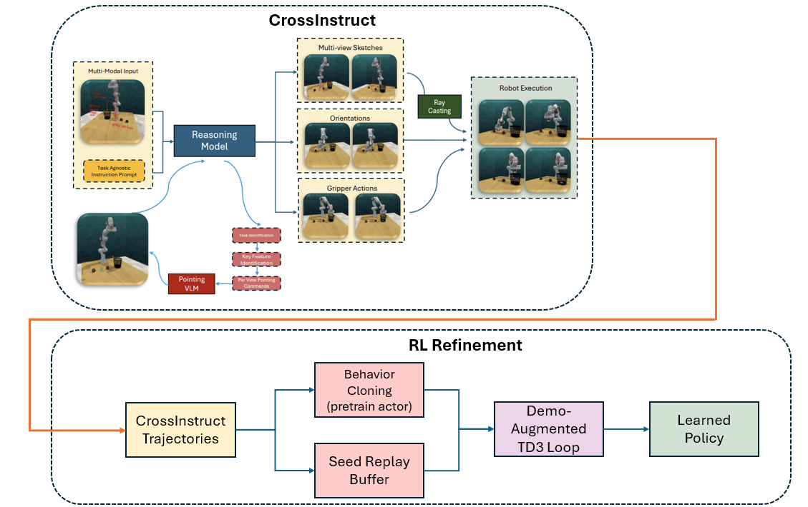
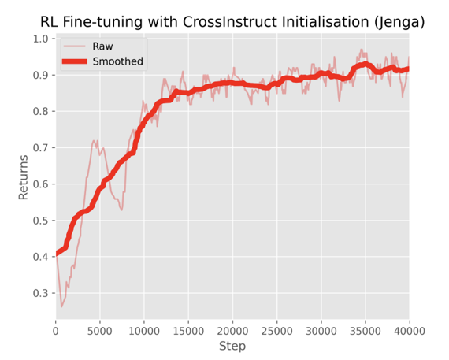

<link rel="stylesheet" href="assets/css/site.css">

<nav class="topbar">
  

    <a href="index.html">Background</a>
    <a href="motivation.html">Motivation</a>
    <a href="method.html">Method</a>
    <a href="video-rollouts.html">Video Rollouts</a>
    <a href="ablations.html">Experiments/Ablations</a>
    <a href="results-analysis.html">Results / Analysis</a>
    <a class="active" href="rl-refinement-future.html">RL Refinement / Future Work</a>
    <a href="https://arxiv.org/abs/2509.21107" target="_blank" rel="noopener">Paper</a>
    <a href="https://github.com/billbaron600/cross-mod/tree/main" target="_blank" rel="noopener">Code</a>
  

</nav>

# RL Refinement & Future Work

## When CrossInstruct is enough

CrossInstruct turns **one** human sketched demo into an executable robot trajectory distribution by sampling rollouts across different seeds / scene randomizations.

For many RLBench tasks, this is already sufficient to reach **~90%+ success on held‑out seeds** with *open‑loop* execution (no closed‑loop RL training).

## Why RL refinement?

A small set of tasks are **contact‑rich** and require **tight coupling** between:
- end‑effector position,
- end‑effector orientation, and
- gripper timing / force interactions.

On these tasks, CrossInstruct often produces rollouts that are *very close* to success, but can miss by a small margin:
- **Insert Square Block on Peg:** ~25% success
- **Play Jenga:** ~55% success

This is exactly the regime where CrossInstruct becomes a strong **bootstrap** for off‑policy RL.

## Failure cases are informative (near‑misses)

Success rate alone can hide how close the policy is to solving the task. The videos below show typical CrossInstruct failure modes: the robot is often *nearly* correct, but fails due to small contact / alignment / timing issues that RL is well‑suited to polish.

  

    <video class="video" controls playsinline preload="metadata" aria-label="Play Jenga—failure rollout (near miss)">
      <source src="assets/video/play_jenga_fail.mp4" type="video/mp4">
    </video>
    
Play Jenga — CrossInstruct failure case (near miss).

  

  

    <video class="video" controls playsinline preload="metadata" aria-label="Square on peg—failure rollout (near miss)">
      <source src="assets/video/square-on-peg-fail.mp4" type="video/mp4">
    </video>
    
Square on peg — CrossInstruct failure case (near miss).

  

## CrossInstruct → Demo‑Augmented RL (TD3/SAC)

Below is the overall refinement pipeline we use. Conceptually, it’s **replay‑buffer seeding with demonstrations**, followed by standard off‑policy RL (often with a BC‑style regularizer early in training).

<figure class="section">
  
  <figcaption>
    RL refinement: CrossInstruct samples diverse rollouts from a single sketch demo, which seed both BC pretraining and the replay buffer for off‑policy RL.
  </figcaption>
</figure>

### Step‑by‑step

1. **One sketch demo from a human.**  
   A single cross‑modal instruction (sketch + text) is provided on one seed.

2. **CrossInstruct generates trajectories across many seeds.**  
   We sample rollouts for different randomizations. Each rollout yields a trajectory with:
   - waypoints / end‑effector motion,
   - orientations, and
   - gripper actions.

3. **Execute rollouts to collect transitions.**  
   Each rollout produces transitions `(s, a, r, s')` (and a terminal success/failure label if available).

4. **Behavior clone from successful rollouts (optional but helpful).**  
   We BC an initial actor policy on the subset of *successful* trajectories (or highest‑return / closest‑to‑goal episodes).

5. **Seed the replay buffer.**  
   We load *all* collected transitions into the replay buffer (successful + near‑miss rollouts).

6. **Run standard off‑policy RL (TD3 or SAC).**  
   Continue training with environment interaction, sampling from the buffer.
   - In practice, adding a **BC regularizer early** helps prevent the actor from drifting away from the good parts of the demo distribution.

## Results: Jenga refinement

For **Play Jenga**, the task reward is sparse (binary success/failure), so training from scratch can fail to ever observe reward.

With CrossInstruct initialization + off‑policy RL refinement, the policy rapidly improves and reaches **~90% success after ~40k environment steps**:

<figure class="section">
  
  <figcaption>
    RL fine‑tuning curve (Jenga): CrossInstruct‑initialized training reaches ~90% success after ~40k steps.
  </figcaption>
</figure>

